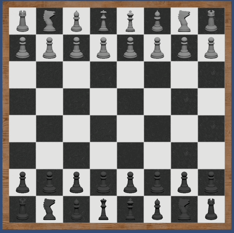
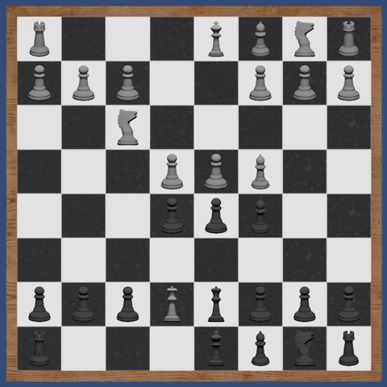
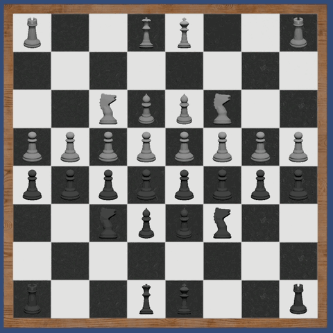
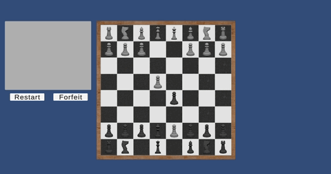
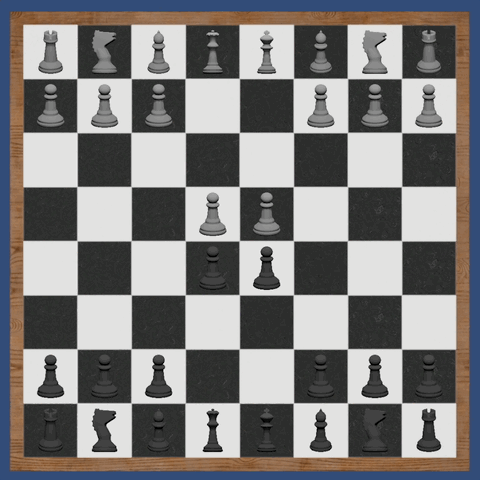
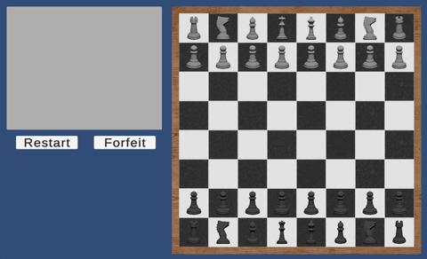

# Unity Chess

A UI-based chess implementation built in **Unity using C#**.

The project focuses on implementing the core chess rules and separating
game state, rule validation, and UI systems.

---

# Gameplay

## Move Highlighting

## Castling

## Pawn Promotion

## En Passant

## Forfeit & Restart

---

# Features

- Piece movement and captures
- Castling (blocked if moving through check)
- En passant
- Pawn promotion UI (Q/R/B/N)
- Move highlighting
- Message popup system
- Forfeit and restart functionality

---

# Running the Project

### From Source

1. Open in **Unity 6000.3.2f1**
2. Open scene:
3. Press Play

---

# Architecture Overview

**BoardModel**

Stores board state and special move conditions such as castling and en passant.

**MovementLogic**

Generates legal moves and validates rule constraints.

**GameController**

Handles player input, turn management, move execution, and UI messaging.

---

# Limitations

- Checkmate / stalemate detection not implemented
- Blundering into check is allowed
- No save/load system
- Undo not implemented

---

View the full source code on GitHub:
https://github.com/Noexa/Chess
